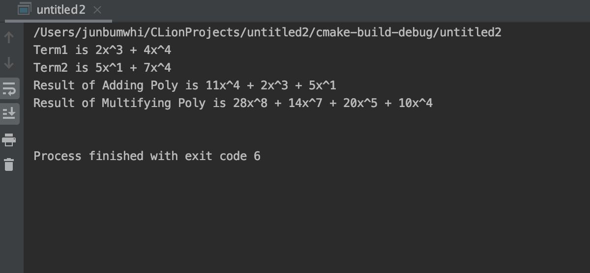
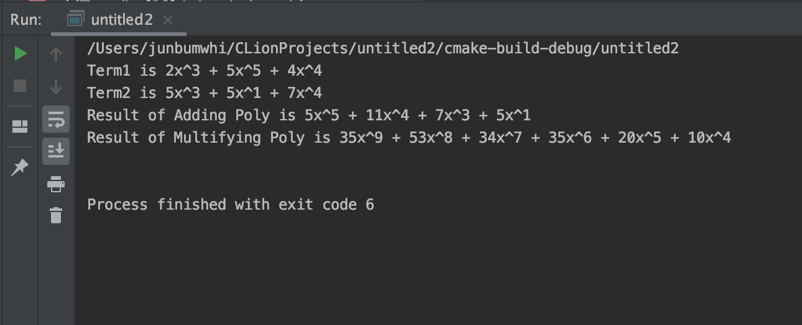

## Polynomial (다항식)

* 문제 : 차례로 주어지는 두 숫자로 하나의 항을 만들고, 주어진 항을 모아 하나의 다항식을 만든다. 그렇게 만들어진 두 다항식의 합과 곱을 출력한다.
 * 구현 : 2차원 배열을 이용하여 구현한다.
 * 참고 : 결과창 result1.png, result2.png 
 * 사용하게 될 함수 : toString(term 제작), swap, addTerm(배열에 담아 poly 만들기), sorting(bubble sort), 
    fix(배열 안 null 값 제거하고, 차수가 같은 것들은 합해서 정리), displayPoly(), addPoly(두 다항식의 합), multiPoly(두 다항식의 곱) 
 * 주의할 점 : 기존에 있는 문제가 아니라 생각한 대로 구현하였기 때문에 디버깅을 하면 오류가 많이 존재할 수 있다.              
 
 ### 예제 1
   

   
   

   
    - addTerm 함수로 input값을 받아 두 다항식을 만들었는데 차례로 (2x^4 + 4x^4), (5x^1 + 7x^4)이다.
    - 두 다항식을 더한 결과, (11x^4 + 2x^3 + 5x^1) 이라는 결과가 나왔다. (AddPoly)
    - 두 다항식을 곱한 결과, (28x^8 + 14x^7 + 20x^5 + 10x^4) 이라는 결과가 나왔다. (MultiPoly)
  ### 예제 2  
    

    
    

    
    - 결과는 예제 1과 같은 방식으로 출력된다.
